# Capability graph

Generated by `bun run graph:build` — **do not edit by hand**. Read it
when scoping a ticket: it says which screens reach which endpoints,
which domain operations they run, and which entity columns exist. CI
runs `bun run graph:check` to keep it honest.

## Findings

None — every route has a caller and every call resolves.

## Wiring

| Route | Callers | Domain operations |
| --- | --- | --- |
| `GET /api/auth/callback` | _none — reached by browser navigation from the emailed magic link, never by a client fetch._ | _direct db (ADR-0010 legacy):_ `magicLinkTokens`, `sessions`, `signinClaims`, `users` |
| `POST /api/auth/confirm` | `composables/useSigninPoll.ts` | _direct db (ADR-0010 legacy):_ `sessions`, `signinClaims`, `users` |
| `POST /api/auth/logout` | `pages/me.vue` | _direct db (ADR-0010 legacy):_ `sessions` |
| `POST /api/auth/magic-link` | `composables/useMagicLink.ts` | _direct db (ADR-0010 legacy):_ `magicLinkTokens`, `signinClaims` |
| `POST /api/auth/poll` | `composables/useSigninPoll.ts` | _direct db (ADR-0010 legacy):_ `signinClaims` |
| `GET /api/dev/error` | `pages/me.vue` | _inline_ |
| `GET /api/entries` | `pages/feed.vue` | `entries.getFeedPage` |
| `POST /api/entries` | `composables/useMediaUpload.ts` | `entries.createEntry` |
| `DELETE /api/entries/:id` | `pages/entries/[id].vue` | `entries.deleteOwnEntry` |
| `GET /api/entries/:id` | `composables/useEntryPlayback.ts` `pages/entries/[id].vue` | `entries.getOwnEntry` |
| `PATCH /api/entries/:id` | _none yet — VKB-110_ | `entries.updateOwnEntry` |
| `DELETE /api/entries/:id/media` | _none yet — VKB-110_ | `entries.removeEntryMedia` |
| `POST /api/entries/:id/media` | `composables/useMediaUpload.ts` | `entries.attachEntryMedia` |
| `GET /api/health` | `pages/offline.vue` | _inline_ |
| `GET /api/me` | `composables/useEntitlements.ts` `composables/useSession.ts` `middleware/auth.ts` `pages/me.vue` | _inline_ |
| `PATCH /api/me` | _none yet — VKB-94_ | _direct db (ADR-0010 legacy):_ `users` |
| `POST /api/me/avatar` | `pages/me.vue` | _inline_ |
| `GET /api/me/avatar-url` | `pages/me.vue` | _inline_ |
| `POST /api/me/avatar/confirm` | `pages/me.vue` | _direct db (ADR-0010 legacy):_ `users` |
| `POST /api/media/confirm` | `composables/useMediaUpload.ts` `pages/dev/media-spike.vue` | `media.confirmMediaUpload` |
| `POST /api/media/process` | _none — QStash worker callback; the caller is the queue, never the client._ | `media.processUploadedMedia` |
| `GET /api/media/status` | `pages/dev/media-spike.vue` | `media.getOwnMedia` |
| `POST /api/media/upload` | `pages/dev/media-spike.vue` | `media.mintUploadSlot` |
| `GET /api/speakers` | `components/compose/Sheet.vue` | `speakers.listSpeakers` |
| `POST /api/speakers` | `components/compose/SpeakerChips.vue` | `speakers.createSpeaker` |

Routes marked _direct db_ reach tables from transport instead of a
domain operation. They are the grandfathered set in
`scripts/layering-check.js`; the list only shrinks.

## Pending wiring

Real gaps with a ticket: the endpoint exists, the screen that will
call it does not. Kept out of Findings so a NEW gap stands out —
not hidden. Wiring one makes its annotation stale, which is a
finding, so the note cannot outlive the gap.

| Route | Tracked by | Note |
| --- | --- | --- |
| `PATCH /api/entries/:id` | VKB-110 | compose edit mode is the first caller |
| `DELETE /api/entries/:id/media` | VKB-110 | compose edit mode is the only client that will call this |
| `PATCH /api/me` | VKB-94 | /me reads displayName but offers no way to edit it. |

## Client surfaces without API calls

Informational, not a finding — a surface may be static by design or a
placeholder awaiting its ticket.

- `app.vue`
- `components/VAvatar.vue`
- `components/VButton.vue`
- `components/app/BottomNav.vue`
- `components/app/TabPlaceholder.vue`
- `components/app/TopBar.vue`
- `components/compose/MediaAttach.vue`
- `components/compose/PremiumSheet.vue`
- `components/entry/ActionsMenu.vue`
- `components/entry/DeleteSheet.vue`
- `components/feed/AudioPlayer.vue`
- `components/feed/EmptyState.vue`
- `components/feed/EntryCard.vue`
- `components/feed/MediaBlock.vue`
- `components/feed/VideoPlayer.vue`
- `components/landing/Page.vue`
- `components/landing/PhoneMock.vue`
- `components/landing/copy.en.ts`
- `components/landing/copy.fr.ts`
- `components/landing/copy.uk.ts`
- `composables/useCompose.ts`
- `composables/useEntryRemoval.ts`
- `composables/usePwa.ts`
- `composables/useSpeakerLine.ts`
- `composables/useTheme.ts`
- `error.vue`
- `layouts/app-detail.vue`
- `layouts/app.vue`
- `layouts/default.vue`
- `pages/discover.vue`
- `pages/fr.vue`
- `pages/index.vue`
- `pages/login.vue`
- `pages/profile.vue`
- `pages/saved.vue`
- `pages/uk.vue`
- `shared/landing-locales.ts`
- `shared/magic-link.ts`
- `shared/media-types.ts`
- `shared/pwa-caches.ts`
- `shared/speaker-age.ts`

## Domain and infra modules

| Module | Layer | Operations | Entities | Calls |
| --- | --- | --- | --- | --- |
| `server/domain/entitlements.ts` | domain | `loadEntitlements` | `users` | — |
| `server/domain/entries.ts` | domain | `attachEntryMedia` `createEntry` `deleteOwnEntry` `getFeedPage` `getOwnEntry` `removeEntryMedia` `updateOwnEntry` | `entries`, `media`, `speakers` | `media.mintUploadSlot` `speakers.getOwnSpeaker` |
| `server/domain/media.ts` | domain | `confirmMediaUpload` `getOwnMedia` `mintUploadSlot` `processUploadedMedia` | `entries`, `media` | `entitlements.loadEntitlements` |
| `server/domain/speakers.ts` | domain | `createSpeaker` `getOwnSpeaker` `listSpeakers` | `entries`, `speakers` | — |
| `server/utils/auth.ts` | infra | — | `sessions`, `users` | — |

## Entities

### `entries`

`collection`, `createdAt`, `gloss`, `id`, `ownerId`, `saidAt`, `sid`, `speaker`, `story`, `tone`, `updatedAt`, `word`

### `magicLinkTokens`

`email`, `expiresAt`, `id`, `pollKeyHash`, `tokenHash`

### `media`

`createdAt`, `derivativeKey`, `durationSec`, `entryId`, `error`, `height`, `id`, `kind`, `originalKey`, `ownerId`, `peaks`, `pendingEntryId`, `posterKey`, `status`, `updatedAt`, `width`

### `sessions`

`createdAt`, `expiresAt`, `id`, `ip`, `userAgent`, `userId`

### `signinClaims`

`claimedAt`, `confirmAttempts`, `confirmCodeHash`, `confirmExpiresAt`, `createdAt`, `expiresAt`, `id`, `pollKeyHash`, `userId`

### `speakers`

`birthday`, `createdAt`, `id`, `name`, `ownerId`, `rel`, `tone`, `updatedAt`

### `users`

`avatarKey`, `createdAt`, `displayName`, `email`, `grants`, `id`, `plan`

## Diagram

Rounded transport nodes have no client caller.

```mermaid
flowchart LR
  subgraph client
    c_components_compose_Sheet_vue["components/compose/Sheet.vue"]
    c_components_compose_SpeakerChips_vue["components/compose/SpeakerChips.vue"]
    c_composables_useEntitlements_ts["composables/useEntitlements.ts"]
    c_composables_useEntryPlayback_ts["composables/useEntryPlayback.ts"]
    c_composables_useMagicLink_ts["composables/useMagicLink.ts"]
    c_composables_useMediaUpload_ts["composables/useMediaUpload.ts"]
    c_composables_useSession_ts["composables/useSession.ts"]
    c_composables_useSigninPoll_ts["composables/useSigninPoll.ts"]
    c_middleware_auth_ts["middleware/auth.ts"]
    c_pages_dev_media_spike_vue["pages/dev/media-spike.vue"]
    c_pages_entries__id__vue["pages/entries/[id].vue"]
    c_pages_feed_vue["pages/feed.vue"]
    c_pages_me_vue["pages/me.vue"]
    c_pages_offline_vue["pages/offline.vue"]
  end
  subgraph transport
    r_GET__api_auth_callback("GET /api/auth/callback")
    r_POST__api_auth_confirm["POST /api/auth/confirm"]
    r_POST__api_auth_logout["POST /api/auth/logout"]
    r_POST__api_auth_magic_link["POST /api/auth/magic-link"]
    r_POST__api_auth_poll["POST /api/auth/poll"]
    r_GET__api_dev_error["GET /api/dev/error"]
    r_GET__api_entries["GET /api/entries"]
    r_POST__api_entries["POST /api/entries"]
    r_DELETE__api_entries__id["DELETE /api/entries/:id"]
    r_GET__api_entries__id["GET /api/entries/:id"]
    r_PATCH__api_entries__id("PATCH /api/entries/:id")
    r_DELETE__api_entries__id_media("DELETE /api/entries/:id/media")
    r_POST__api_entries__id_media["POST /api/entries/:id/media"]
    r_GET__api_health["GET /api/health"]
    r_GET__api_me["GET /api/me"]
    r_PATCH__api_me("PATCH /api/me")
    r_POST__api_me_avatar["POST /api/me/avatar"]
    r_GET__api_me_avatar_url["GET /api/me/avatar-url"]
    r_POST__api_me_avatar_confirm["POST /api/me/avatar/confirm"]
    r_POST__api_media_confirm["POST /api/media/confirm"]
    r_POST__api_media_process("POST /api/media/process")
    r_GET__api_media_status["GET /api/media/status"]
    r_POST__api_media_upload["POST /api/media/upload"]
    r_GET__api_speakers["GET /api/speakers"]
    r_POST__api_speakers["POST /api/speakers"]
  end
  subgraph domain
    o_entitlements_loadEntitlements["entitlements.loadEntitlements"]
    o_entries_attachEntryMedia["entries.attachEntryMedia"]
    o_entries_createEntry["entries.createEntry"]
    o_entries_deleteOwnEntry["entries.deleteOwnEntry"]
    o_entries_getFeedPage["entries.getFeedPage"]
    o_entries_getOwnEntry["entries.getOwnEntry"]
    o_entries_removeEntryMedia["entries.removeEntryMedia"]
    o_entries_updateOwnEntry["entries.updateOwnEntry"]
    o_media_confirmMediaUpload["media.confirmMediaUpload"]
    o_media_getOwnMedia["media.getOwnMedia"]
    o_media_mintUploadSlot["media.mintUploadSlot"]
    o_media_processUploadedMedia["media.processUploadedMedia"]
    o_speakers_createSpeaker["speakers.createSpeaker"]
    o_speakers_getOwnSpeaker["speakers.getOwnSpeaker"]
    o_speakers_listSpeakers["speakers.listSpeakers"]
  end
  subgraph infra
    i_auth["server/utils/auth.ts"]
  end
  subgraph data
    e_entries[("entries")]
    e_magicLinkTokens[("magicLinkTokens")]
    e_media[("media")]
    e_sessions[("sessions")]
    e_signinClaims[("signinClaims")]
    e_speakers[("speakers")]
    e_users[("users")]
  end
  r_GET__api_auth_callback -.-> e_magicLinkTokens
  r_GET__api_auth_callback -.-> e_sessions
  r_GET__api_auth_callback -.-> e_signinClaims
  r_GET__api_auth_callback -.-> e_users
  c_composables_useSigninPoll_ts --> r_POST__api_auth_confirm
  r_POST__api_auth_confirm -.-> e_sessions
  r_POST__api_auth_confirm -.-> e_signinClaims
  r_POST__api_auth_confirm -.-> e_users
  c_pages_me_vue --> r_POST__api_auth_logout
  r_POST__api_auth_logout -.-> e_sessions
  c_composables_useMagicLink_ts --> r_POST__api_auth_magic_link
  r_POST__api_auth_magic_link -.-> e_magicLinkTokens
  r_POST__api_auth_magic_link -.-> e_signinClaims
  c_composables_useSigninPoll_ts --> r_POST__api_auth_poll
  r_POST__api_auth_poll -.-> e_signinClaims
  c_pages_me_vue --> r_GET__api_dev_error
  c_pages_feed_vue --> r_GET__api_entries
  r_GET__api_entries --> o_entries_getFeedPage
  c_composables_useMediaUpload_ts --> r_POST__api_entries
  r_POST__api_entries --> o_entries_createEntry
  c_pages_entries__id__vue --> r_DELETE__api_entries__id
  r_DELETE__api_entries__id --> o_entries_deleteOwnEntry
  c_composables_useEntryPlayback_ts --> r_GET__api_entries__id
  c_pages_entries__id__vue --> r_GET__api_entries__id
  r_GET__api_entries__id --> o_entries_getOwnEntry
  r_PATCH__api_entries__id --> o_entries_updateOwnEntry
  r_DELETE__api_entries__id_media --> o_entries_removeEntryMedia
  c_composables_useMediaUpload_ts --> r_POST__api_entries__id_media
  r_POST__api_entries__id_media --> o_entries_attachEntryMedia
  c_pages_offline_vue --> r_GET__api_health
  c_composables_useEntitlements_ts --> r_GET__api_me
  c_composables_useSession_ts --> r_GET__api_me
  c_middleware_auth_ts --> r_GET__api_me
  c_pages_me_vue --> r_GET__api_me
  r_PATCH__api_me -.-> e_users
  c_pages_me_vue --> r_POST__api_me_avatar
  c_pages_me_vue --> r_GET__api_me_avatar_url
  c_pages_me_vue --> r_POST__api_me_avatar_confirm
  r_POST__api_me_avatar_confirm -.-> e_users
  c_composables_useMediaUpload_ts --> r_POST__api_media_confirm
  c_pages_dev_media_spike_vue --> r_POST__api_media_confirm
  r_POST__api_media_confirm --> o_media_confirmMediaUpload
  r_POST__api_media_process --> o_media_processUploadedMedia
  c_pages_dev_media_spike_vue --> r_GET__api_media_status
  r_GET__api_media_status --> o_media_getOwnMedia
  c_pages_dev_media_spike_vue --> r_POST__api_media_upload
  r_POST__api_media_upload --> o_media_mintUploadSlot
  c_components_compose_Sheet_vue --> r_GET__api_speakers
  r_GET__api_speakers --> o_speakers_listSpeakers
  c_components_compose_SpeakerChips_vue --> r_POST__api_speakers
  r_POST__api_speakers --> o_speakers_createSpeaker
  o_entitlements_loadEntitlements --> e_users
  o_entries_attachEntryMedia --> e_entries
  o_entries_createEntry --> e_entries
  o_entries_deleteOwnEntry --> e_entries
  o_entries_getFeedPage --> e_entries
  o_entries_getOwnEntry --> e_entries
  o_entries_removeEntryMedia --> e_entries
  o_entries_updateOwnEntry --> e_entries
  o_entries_attachEntryMedia --> e_media
  o_entries_createEntry --> e_media
  o_entries_deleteOwnEntry --> e_media
  o_entries_getFeedPage --> e_media
  o_entries_getOwnEntry --> e_media
  o_entries_removeEntryMedia --> e_media
  o_entries_updateOwnEntry --> e_media
  o_entries_attachEntryMedia --> e_speakers
  o_entries_createEntry --> e_speakers
  o_entries_deleteOwnEntry --> e_speakers
  o_entries_getFeedPage --> e_speakers
  o_entries_getOwnEntry --> e_speakers
  o_entries_removeEntryMedia --> e_speakers
  o_entries_updateOwnEntry --> e_speakers
  o_media_confirmMediaUpload --> e_entries
  o_media_getOwnMedia --> e_entries
  o_media_mintUploadSlot --> e_entries
  o_media_processUploadedMedia --> e_entries
  o_media_confirmMediaUpload --> e_media
  o_media_getOwnMedia --> e_media
  o_media_mintUploadSlot --> e_media
  o_media_processUploadedMedia --> e_media
  o_speakers_createSpeaker --> e_entries
  o_speakers_getOwnSpeaker --> e_entries
  o_speakers_listSpeakers --> e_entries
  o_speakers_createSpeaker --> e_speakers
  o_speakers_getOwnSpeaker --> e_speakers
  o_speakers_listSpeakers --> e_speakers
  i_auth --> e_sessions
  i_auth --> e_users
```

